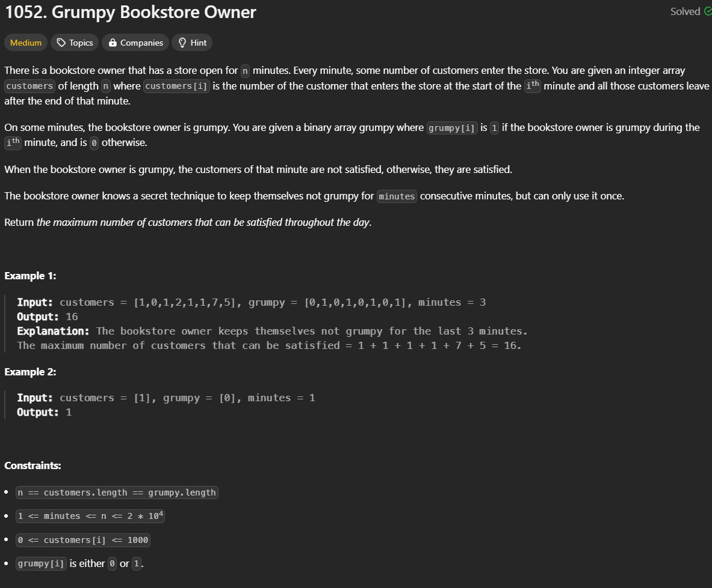

# [Leetcode Url ](https://leetcode.com/problems/grumpy-bookstore-owner/description/?envType=daily-question&envId=2024-06-21) 

## Image
 
# Intuition
At first my approach i was finding the window index in which sum is the largest until realized that there are window index that sum eventhough the largest. But the `grumpy` index of that window is all 0. turn out i have to find the window index which have the largest loss or the window where the `grumpy[i..]==1` cause the largest loss
# Approach
So i find the window index with the size of `minutes` which have the largest loss get it index and assign 0 to `grumpy[i...window]` indecies

# Complexity
- Time complexity:
$$O(n)$$
- Space complexity:
$$O(n)$$
# Code
```cpp
class Solution {
public:
    int maxSatisfied(vector<int>& customers, vector<int>& grumpy, int minutes) {
        int n = customers.size();
        // int windowSize = n - minutes;
        int notSatisfiedCusomter = 0;

        int i = 0;
        for( i ; i < minutes ; i++){
            // if the owner does grumpy
            if(grumpy[i] == 1)
            {
                notSatisfiedCusomter += customers[i];
            }
        }
        int maxNotSatisfiedCusomter = notSatisfiedCusomter;
        int index = i-1;
        for( i ; i < n ; i++){
            // if the owner does grumpy
            if(grumpy[i] == 1)
            {
                notSatisfiedCusomter += customers[i];
            }
            if(grumpy[i - minutes] == 1)
            {
                notSatisfiedCusomter -= customers[i - minutes];
            }
            
            if(maxNotSatisfiedCusomter < notSatisfiedCusomter){
                //std::cout << i << "max= " << notSatisfiedCusomter << "||";
                maxNotSatisfiedCusomter = notSatisfiedCusomter;
                index = i;
            }
        }
        for(i = index ; i > index - minutes ; i--){
            grumpy[i] = 0;
        }
        int maxSC = 0;
        for(i = 0; i < n ; i++){
            if(grumpy[i] == 0){
                maxSC += customers[i];
            }
        }

        return maxSC;
    }
};
```
