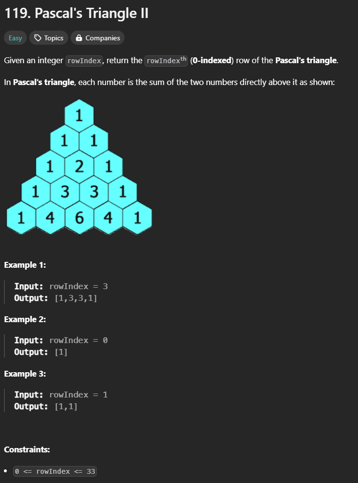

 
# Intuition
<!-- Describe your first thoughts on how to solve this problem. -->
# [Leetcode Link](https://leetcode.com/problems/pascals-triangle-ii/description/) 
# Approach
since the problem only need to return one vector so i came up with 
using one vector and one `pre` variable to store the previous value
# Complexity
- Time complexity:
<!-- Add your time complexity here, e.g. $$O(n)$$ -->
$$O(n^2)$$
- Space complexity:
<!-- Add your space complexity here, e.g. $$O(n)$$ -->
$$O(1)$$
# Code
```cpp
class Solution {
public:
    vector<int> getRow(int rowIndex) {
        vector<int> g(rowIndex+1,1);
        int pre = 0;

        for(int i = 2; i <= rowIndex ; i++){
            pre = g[0];
            for(int j = 1 ; j < i ; j++){
                g[j] = pre + g[j];
                pre = g[j] - pre;
            }
        }
        return g;
    }
};
```
