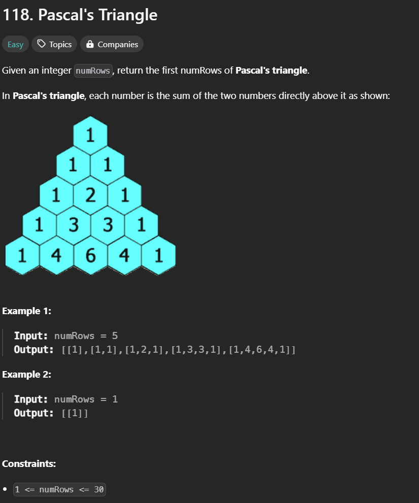

# [Description Link](https://leetcode.com/problems/pascals-triangle/description/) 

# Problem 
 

 # Intuition
Very good for someone who starting to working on dynamic programming problems (i've just finished the [Climbing Stair](https://leetcode.com/problems/climbing-stairs/))
# Approach
as the problem describe i must return a list of rows. Each row is form based on previous rows and calculations.

# Complexity
- Time complexity:
<!-- Add your time complexity here, e.g. $$O(n)$$ -->
$$O(n^2)$$

- Space complexity:
<!-- Add your space complexity here, e.g. $$O(n)$$ -->
$$O(n^2)$$
# Code
```cpp
class Solution {
public:
    vector<vector<int>> generate(int numRows) {
        vector<vector<int>> g;
        for(int i = 0; i < numRows ; i++){
            vector<int> g1 (i+1,1);
            for(int j = 1 ; j < i ; j++){
                g1[j] = g[i-1][j] + g[i-1][j-1];
            }
            g.push_back(g1);
        }
        return g;
    }
};
```
