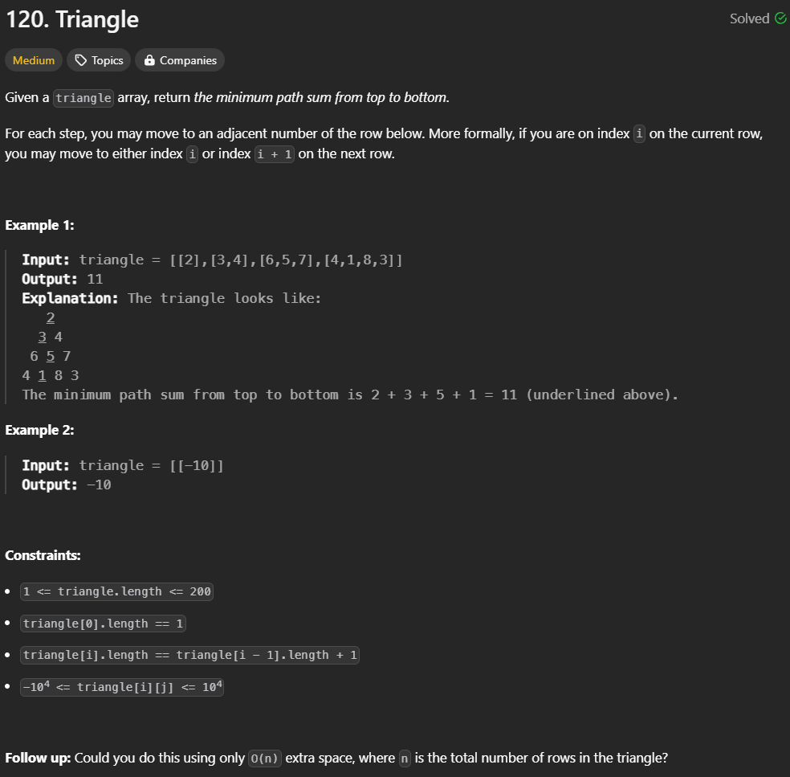

# [Leetcode Link ](https://leetcode.com/problems/triangle/description/) 
 
# Intuition
At First i was too naive that i just need to select the smallest element from top down . and i realized that select the smallest the smallest element from top down will miss another element which are smaller or the negative value which is even smaller.
# Approach
Using Dynamic Programming Approach . The first and last element of the i-rows (from index 2...n) only need to assign `[j]` and `[j+1]` respectively and all the element inside the i-rows is assigned to the smaller number from the previous `triangle[i+1][j] = min(triangle[i+1][j] + triangle[i][j-1],triangle[i+1][j] + triangle[i][j])`

# Complexity
1. Outer Loop (i-loop): The outer loop runs from i = 0 to i < n-1, which means it iterates n-1 times, where n is the number of rows in the triangle.
2. Inner Loop (j-loop): The inner loop runs from j = 1 to j < triangle[i].size(). The size of triangle[i] is i+1, so the inner loop runs i times on average for each i.
- Time complexity:
The time complexity is quadratic, which is reasonable for this type of problem. (explained by chatGPT)
$$Total Operations= 
i=0
∑
n−2
​
 i=0+1+2+...+(n−2)= 
2
(n−2)(n−1)
​$$
<!-- Add your time complexity here, e.g. $$O(n)$$ -->
$$O(n^2)$$
- Space complexity:
for using the same triangle input so the space is not grow during runtime
$$O(n)$$ 

# Code
```cpp
class Solution {
public:
    int minimumTotal(vector<vector<int>>& triangle) {
        int n = triangle.size();
        int index = 0;
        int i = 0;
        int j = 0;
        for(i = 0; i < n -1 ;i++){
            j = 0;
            triangle[i+1][j] +=  triangle[i][j];
            for(j = 1 ; j < triangle[i].size(); j++){
                triangle[i+1][j] = std::min(triangle[i+1][j] + triangle[i][j-1],triangle[i+1][j] + triangle[i][j]) ;
            }
            triangle[i+1][j] +=  triangle[i][j-1];
        }
        int minPath = triangle[n-1][0];
        // std::cout << triangle[n-1][0] << " | " ;
        for(int i = 1; i < triangle[n-1].size();i++){
            // std::cout << triangle[n-1][i] << " | " ;
            minPath = std::min(minPath,triangle[n-1][i]);
        }
        return minPath;
    }
};
```
