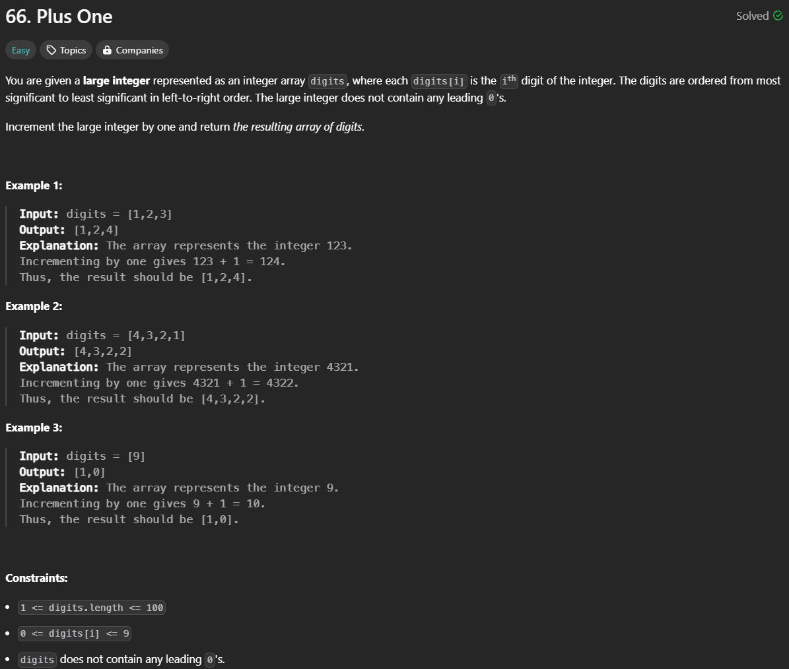

# Problem Img
 
# [Leetcode Post Link](https://leetcode.com/problems/plus-one/solutions/5339778/my-personal-approach-with-vector/)  
 
# Approach
<!-- Describe your approach to solving the problem. -->
starting from the last index of digits `vector` declared another vector for the return value using `push_back` after that return the vector in reverse order.
# Complexity
- Time complexity:
$$O(n)$$

- Space complexity:
$$O(n)$$

# Cod
```cpp
class Solution {
public:
    vector<int> plusOne(vector<int>& digits) {
        int r = 1;
        int n = digits.size();
        vector<int> reVal ;
        int num ;

        for(int i = n - 1; i >= 0 ;i--){
            num = digits[i] + r;
            if(num > 9){
                r = 1;
                reVal.push_back(0);
            }else{
                r = 0;
                reVal.push_back(num);
            }
        }
        if(r > 0) reVal.push_back(r);

        reverse(reVal.begin(), reVal.end());
        return reVal;
    }
};
```
